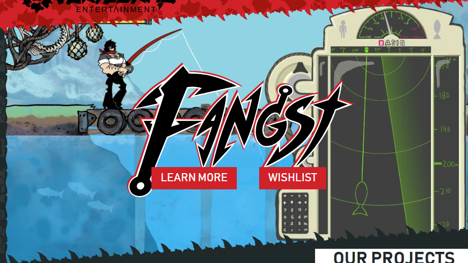
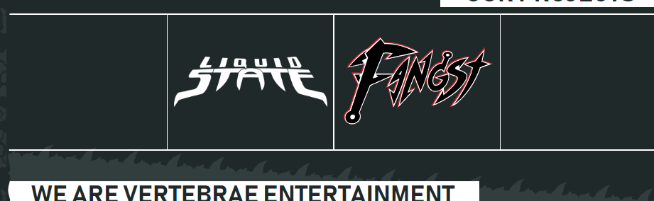
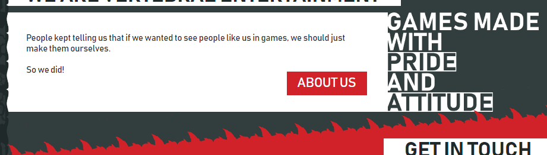
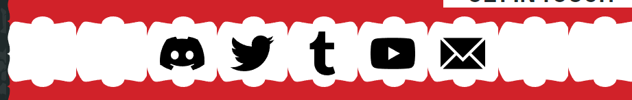
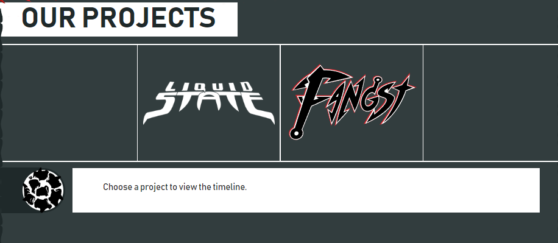
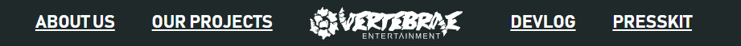

# Vertebrae Entertainment

## How to run this

You will need to have NodeJS and git installed before you do this. First clone the repo. Then run:

```
npm install
npm start
```

This will install the dependencies and start the project locally. You may view the result in `http://localhost:4200`.

If you do make changes, remember that the website will be published automatically when code is pushed to the `main` branch. This is done using the [`Build and Deploy`](./.github/workflows/build-deploy.yml) Github Action included in this repo.

## Micro Content Management System - Introduction

This is a custom made json based CMS using plain web components to render it's content.
The configuration is located under [`./src/.root/index.json`](./src/.root/index.json), and each blog post is a markdown file
located under [`./src/.root/_posts`](./src/.root/_posts/).

The website is structured by three routes:

- [Home](https://vertebrae-ent.github.io/) - most of the configuration from index.json is for the contents and layout of the main landing page
- [About us](https://vertebrae-ent.github.io/about) - A small introductory page of Vertebrae Entertainment
- [Projects](https://vertebrae-ent.github.io/projects) - A page showcasing the projects Vertebrae Entertainment is building

For more details and code, please look under [./src/app](./src/app/README.md).

Below is a small documentation of the json structure we support.

```
{
  "home": [],      <-- Contains the content for the main landing page
  "about": {},     <-- The configuration for the about page
  "projects: {},   <-- The configuration for the projects page
  "linkList": []   <-- Footer links, visible on every page
}
```

## [`home`](./src/app/views/home/README.md) Overview

The configuration for the main landing-page - the [`/`](https://vertebrae-ent.github.io/) route.
This part of the configuration contains sections of content. Each object in the array covers properties for one section of the landing page. There are also some common properties for all content-types, but also some specific to a particular type. Let's go over the common ones first:

Each section must have a `type`. These are the different types we support:

### [`hero`](./src/app/views/home/sections/hero.component.ts)



A hero element is usually an image but can also be a text, a slogan, something eye-catchy, which creates a "selling-point" for the product or company. It can also contain an action or two - links to the product or something related to the product. So the additional properties available for sections of `"type": "hero"` are:

- `type` - **(Required)** must be `hero`
- `header` - **(Optional)** the title
- `headerPosition` - **(Optional)** either `left` (_default if omitted_) or `right`
- `class` - a css class to add to this section.
- `backdropImage` - a url to an image to set as the background for the hero element
- `logo` - a url to an overlaid image, usually a logo with transparent background laid out on top of the backdrop image
- `actions` - buttons to present on top of the backdrop image, represented as an array of:
  - `name` - the link text
  - `url` - **(Required)** the url for the link

**Example:**

```json
{
  "type": "hero",
  "backdropImage": "link/to/background/image.webp",
  "logo": "link/to/logo.svg",
  "actions": [
    {
      "name": "Link text",
      "url": "/link/to/page"
    }
  ]
}
```

### [`carousel`](./src/app/views/home/sections/carousell.component.ts)



This type of element works as a show-case. It presents images in a horizontal grid. Each image can have a link attached to it.

- `type` - **(Required)** must be `carousel`
- `header` - **(Optional)** the title
- `headerPosition` - **(Optional)** either `left` (_default if omitted_) or `right`
- `class` - a css class to add to this section.
- `images` - An array of configuration objects for an image.
  - `link` - if this is present in the object, the image will be clickable and route to either an internal or external url.
  - `header` - used for accessibility reasons.

**Example:**

```json
{
  "type": "carousel",
  "header": "This is a header text",
  "headerPosition": "right",
  "class": "toothrack top",
  "images": [
    {
      "url": "link/to/image.webp",
      "header": "Project name",
      "link": "/link/to/page"
    }
  ]
}
```

### [`text`](./src/app/views/home/sections/text.component.ts)



A block of text accompanied with an optional image

- `type` - **(Required)** must be `text`
- `header` - **(Optional)** the title
- `headerPosition` - **(Optional)** either `left` (_default if omitted_) or `right`
- `class` - a css class to add to this section.
- `text` - The block of text to render. Linebreaks are supported through `\n`.
- `image` - An optional image to display aside the text
  - `position` - Either `before` (_default if omitted_) or `after`
  - `url` - **(Required)** The image url to display

**Example:**

```json
{
  "type": "text",
  "header": "This is a header text",
  "text": "And some content",
  "class": "toothrack top reverse",
  "actions": [
    {
      "name": "Link text",
      "url": "/link/to/page"
    }
  ],
  "image": {
    "position": "after",
    "url": "link/to/image.svg"
  }
}
```

### [`social`](./src/app/views/home/sections/social.component.ts)



A list of contact points, usually social media links but if `action` is present, it will link to a custom action. Currently we only support one action: `newsletter`, which will bring up a newsletter subscription dialog.

- `type` - **(Required)** must be `social`
- `header` - **(Optional)** the title
- `headerPosition` - **(Optional)** either `left` (_default if omitted_) or `right`
- `class` - a css class to add to this section.
- `links` - An array of configuration objects:
  - `image` - **(Required)** A url for an image to represent the contact point
  - `name` - The name of the contact point. Should be present for accessibility reasons
  - `description` - A text displayed as tooltip when user hovers over the link.
  - `url` - **(Optional)** either a url is provided or an action. External links must start with `https://`
  - `action` - **(Optional)** if not provided, a url must be provided. Currently only `newsletter` is supported

**Example:**

```json
{
  "type": "social",
  "header": "This is a header text",
  "headerPosition": "right",
  "class": "toothrack top",
  "links": [
    {
      "name": "Link name",
      "description": "A tooltip text",
      "url": "https://external/link",
      "image": "link/to/image.svg"
    }
  ]
}
```

## [`about`](./src/app/views/about-us/README.md) Overview

The configuration for the [`/about`](https://vertebrae-ent.github.io/about) route.
This is a page dedicated to the people involved in vertebrae entertainment.

- `header` - The page title
- `description` - A descriptive text displayed when no person is selected
- `people` - An array of people
  - `name` - The name of the person
  - `role` - What role do they have in the company
  - `image` - A url for an image representing the person
  - `description` - A text to display when that person is selected. Linebreaks are supported through `\n`.

**Example:**

```json
  "about": {
    "header": "This is a header text",
    "description": "And some content",
    "people": [
      {
        "name": "Article header",
        "role": "Sub header",
        "image": "link/to/image.webp",
        "description": "Descriptive text"
      }
    ]
  }
```

## [`projects`](./src/app/views/projects/README.md) Overview



The configuration for the [`/projects`](https://vertebrae-ent.github.io/projects) route.
This is a page dedicated to the projects vertebrae entertainment is working on.

- `url` - A link to the project logo
- `header` - The project title.
- `link` - The project page link. Must be `/projects/[your-project-name]`
- `timeline` - A list of markdown filenames located under [./src/.root/\_posts](./src/.root/_posts/). Filenames must have the following format: `yymmdd.md` - That is two digit year, two digit month and two digit day.

**Example:**

```json
  "projects": [
    {
      "url": "link/to/image.webp",
      "header": "Project title",
      "link": "/link/to/page",
      "timeline": [
        "[yymmdd].md",
        "[yymmdd].md"
      ]
    }
  ]
```

## [`linkList`](./src/app/shared/link-list.component.ts) Overview



A simple list of links

- `name` - The text to display on the link
- `url` - The url the link should point to. If this should point to an external page, it must start with `https://`

**Example:**

```json
  "linkList": [
    {
      "name": "Link text",
      "url": "/link/to/page"
    }
  ]
```
